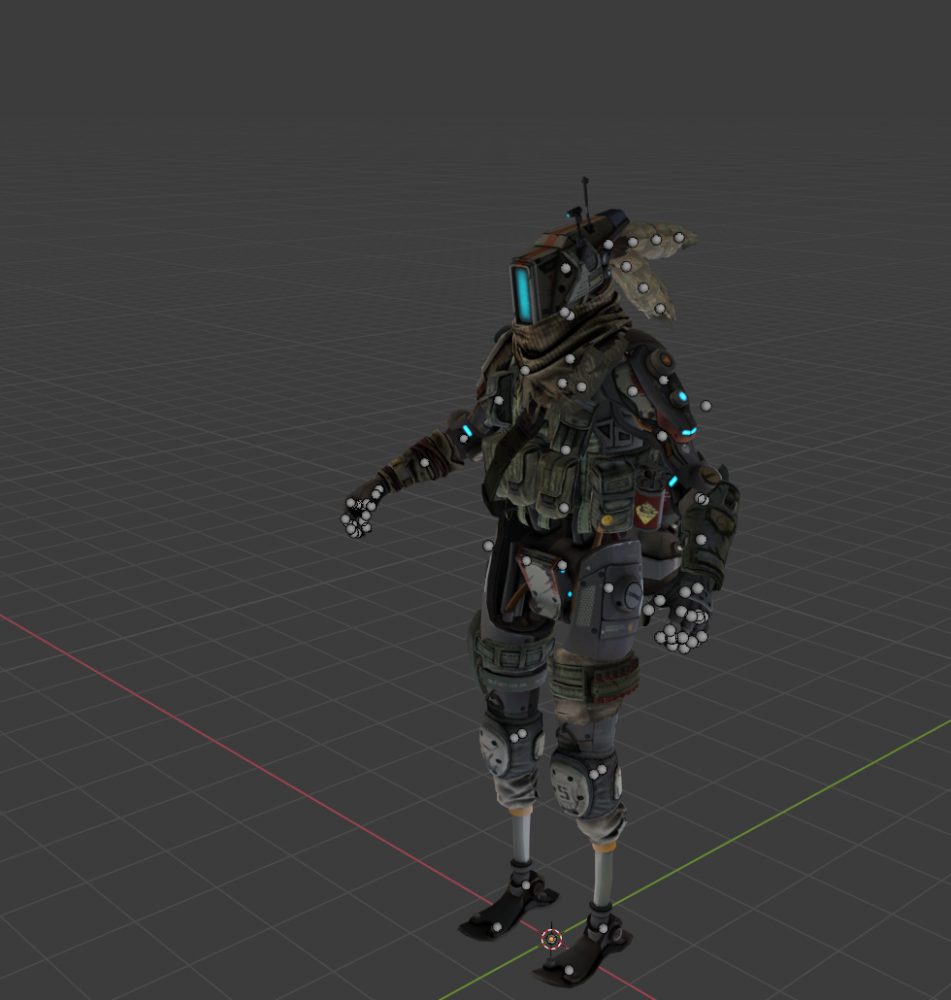
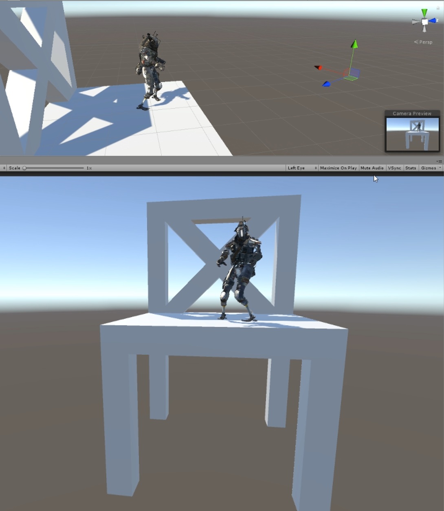

# Hello there 👋

## About me:

- 🔭 I’m currently working on my online [parkguidance system](https://github.com/Neoministein/parkguidance)
- 🌱 I’m currently learning Microservices with Helidon and Kubernetes
- 💬 Ask me about Java, JakartaEE, SQL
- ⚡ I have worked with Java, C#, JS, HTML, CSS, SQL
- 🔨 I have worked using GIT, SVN, Docker, Kubernetes, ElasticSearch, Kibana, Jenkins, Unity, SteamVR, Arduino

 
 
    
## Public projects

### Parkguidance 
  
The [parguidance system](https://github.com/Neoministein/parkguidance) system is designed to receive data from different parking garages in order to visibly displays the current capacity and Infos of the hooked-up parking garages and gives a rough estimate of its free capacity throughout the day. 

It also provides features as:
- Finding a parking garage near you 
- Finding a parking garage near an address 
- Showing a heatmap of the garage capacty througout the day 
  

  
### Mp4Split

[Mp4Split](https://github.com/Neoministein/Mp4Split) was created as an addon for NVIDIA's instant replay and record function. This application allows you to define mutiple highlight sections while you are recording a video and automatically cuts the highlights into sperate video files after you stopped recording. 
  
 
 
  
## Private projects

### Unity Game Jam Project

Small games made within couple of days based on a theme

- Theme: Joined Together -> [Dungeon of Trovas](https://siliwan.itch.io/the-dungeon-of-trovas)
  
### Motion Capture Recording

Using a SteamVR Headset and Unity you are able to record your motion data and export it to programms like Blender.
  

### DIY V-Tuber Software 

Using my Motion Capture Recording Software I integrated a 3d model with which you now have virtual avatar mimicing the motion. This can be used for recoring or live broadcasts with a virutal avatar.
  

  
 #### It is dengerous to go alone here take this: 

  

